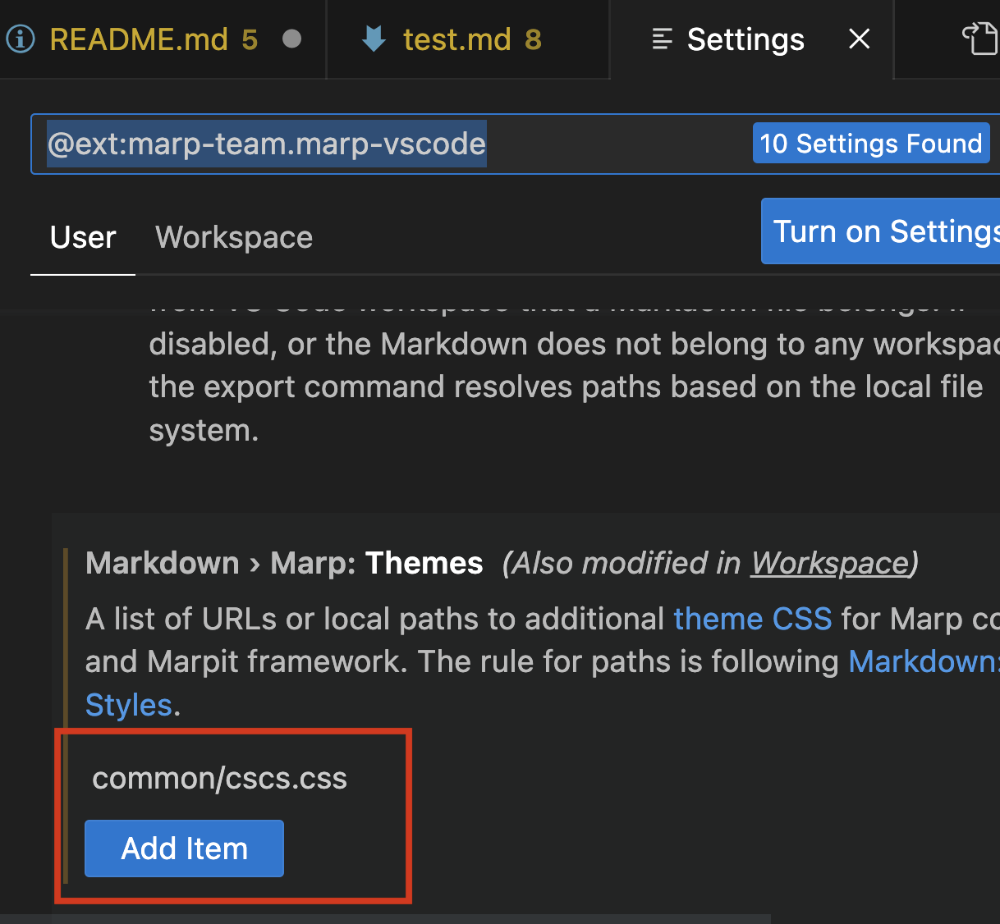
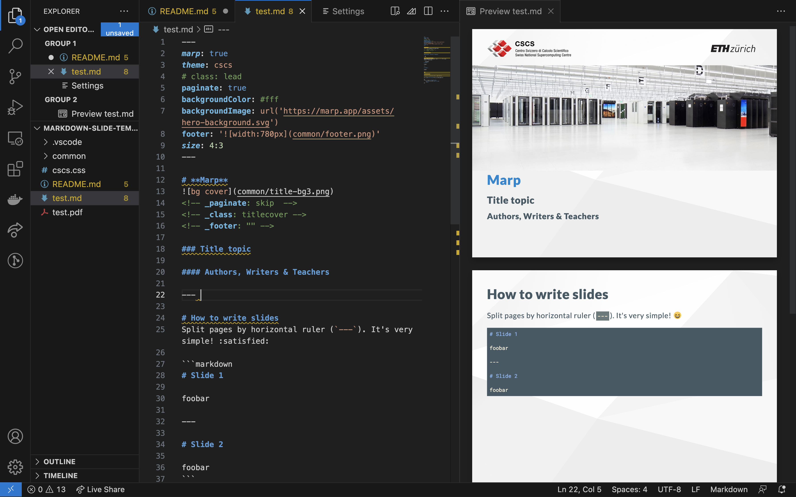

# CSCS Markdown Slide Deck Template

## Why?
Some of us may prefer to collaborate over Git rather than Google Docs. And LaTeX for slides is cumbersome and not very easy to setup locally. We are nerdy, but also lazy.

## What?
> [Marpit](https://marpit.marp.app/) /mɑːrpɪt/ is the skinny framework for creating slide deck from Markdown. It can transform Markdown and CSS theme(s) to slide deck composed of static HTML and CSS and create a web page convertible into slide PDF by printing.

> [Visual Studio Code](https://code.visualstudio.com) combines the simplicity of a code editor with what developers need for their core edit-build-debug cycle. It provides comprehensive code editing, navigation, and understanding support along with lightweight debugging, a rich extensibility model, and lightweight integration with existing tools.

Combining these two, we get a really easy to use framework for creating slide decks.

## How?
> [Marp](https://marp.app) (also known as the Markdown Presentation Ecosystem) provides an intuitive experience for creating beautiful slide decks. You only have to focus on writing your story in a Markdown document.

The [Marp extension](https://marketplace.visualstudio.com/items?itemName=marp-team.marp-vscode) is available on the VS Code marketplace. 

There is also a [CLI version](https://github.com/marp-team/marp-cli) in case anyone feels troubled to move away from their beloved terminal.

## Getting Started

After installing the extension on VS code, clone the repo and open `test.md`.

Click the highlighted button to see preview. However the preview on the right side will not look right.

Click the button next to it to open Settings. In the **Themes** section, add `common/cscs.css` so that it finds the custom theme in its path. Here some custom definitions have been made.

Having done these steps, the environment should look like the image above. The preview should be updated live. There are samples to insert code blocks, images and math.

